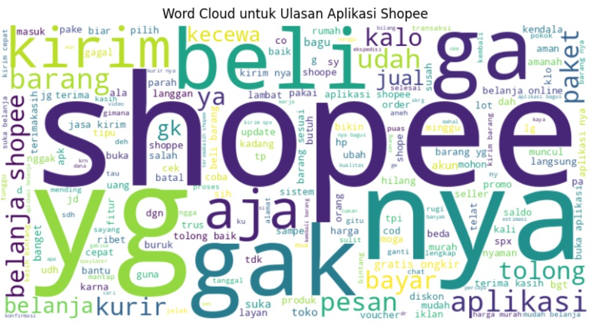

# Analisis Sentimen Ulasan Shopee Menggunakan Deep Learning

## Pengantar: Membuka Rahasia di Balik Ulasan Pengguna
Dalam dunia e-commerce yang berkembang pesat seperti saat ini, ulasan pelanggan memegang peran yang sangat penting untuk menjaga daya saing bisnis. Platform Shopee, sebagai salah satu marketplace terbesar di Asia Tenggara, mendapatkan ribuan ulasan setiap harinya. Namun, apakah Anda pernah merasa penasaran tentang apa yang sebenarnya dikatakan pelanggan Anda tentang produk dan layanan yang ditawarkan? Apakah mereka merasa puas dengan pembelian mereka, atau justru kecewa dengan pengalaman yang diterima? 🌟

Melalui proyek ini, kami memanfaatkan **deep learning** untuk menggali lebih dalam ke dalam ulasan pelanggan dan mengungkapkan emosi serta sentimen yang tersembunyi di balik setiap kata. Dengan menggunakan model-model machine learning yang canggih seperti **CNN**, **LSTM**, dan **GRU**, kami dapat menyaring dan mengklasifikasikan ulasan menjadi tiga kategori sentimen yang jelas: **Positif**, **Netral**, dan **Negatif**. Penasaran bagaimana kami melakukannya? Baca terus untuk menemukan lebih lanjut! 💡

## Mengapa Ini Penting?
Dalam dunia e-commerce yang sangat kompetitif, pemahaman yang mendalam tentang sentimen pelanggan sangat penting untuk menjaga kualitas layanan dan meningkatkan kepuasan pelanggan. Dengan menganalisis ulasan produk, bisnis dapat:

- **Meningkatkan produk** 🚀: Mengidentifikasi kelemahan produk berdasarkan umpan balik pelanggan untuk melakukan perbaikan.
- **Meningkatkan pengalaman pelanggan** 🛍️: Mengetahui apa yang disukai atau tidak disukai oleh pelanggan, memungkinkan bisnis untuk menyesuaikan strategi pemasaran dan layanan.
- **Meningkatkan penjualan** 💵: Dengan menerapkan wawasan yang diperoleh dari analisis ulasan, perusahaan dapat memperbaiki produk dan meningkatkan konversi penjualan.

Namun, masalah besar yang sering dihadapi oleh banyak perusahaan adalah bagaimana menyaring ribuan bahkan jutaan ulasan secara manual. **Deep Learning** hadir sebagai solusi yang sangat efektif untuk menyelesaikan masalah ini. 🤖

Dengan bantuan model-model deep learning, kami berhasil menganalisis ulasan pengguna Shopee dalam hitungan menit dan mengklasifikasikannya ke dalam tiga kategori sentimen: **Positif**, **Netral**, dan **Negatif**. Proyek ini tidak hanya meningkatkan kecepatan analisis, tetapi juga memungkinkan pengambilan keputusan berbasis data yang lebih cepat dan lebih tepat. ⚡

## Tujuan Proyek
Tujuan utama dari proyek ini adalah untuk mengklasifikasikan ulasan Shopee secara otomatis berdasarkan sentimen mereka, yang akan membantu memahami tingkat kepuasan pelanggan secara lebih mendalam. Ulasan dibagi menjadi tiga kategori sentimen:

- **Positif** 😄: Ulasan yang menunjukkan kepuasan pelanggan.
- **Netral** 😐: Ulasan dengan perasaan campuran atau tidak terlalu kuat.
- **Negatif** 😞: Ulasan yang menunjukkan ketidakpuasan pelanggan.

Dengan memanfaatkan **deep learning** dan teknik **NLP (Natural Language Processing)**, proyek ini memungkinkan pengolahan ulasan dalam jumlah besar secara otomatis, yang akan menghemat banyak waktu dan memberikan wawasan berharga yang mungkin terlewatkan jika dilakukan secara manual.

**"Mendengarkan pelanggan adalah kunci untuk tumbuh. Mengerti mereka adalah langkah pertama untuk menciptakan hubungan yang lebih kuat."** 💬

## Teknologi yang Digunakan
### Alat dan Library
Berikut adalah teknologi utama yang digunakan dalam proyek ini:

- **Python** 🐍: Bahasa pemrograman yang memungkinkan pengembangan model deep learning dan pemrosesan data yang efisien.
- **TensorFlow/Keras** 🤖: Framework deep learning yang digunakan untuk membangun dan melatih model neural network.
- **scikit-learn** 📊: Library untuk machine learning tradisional, termasuk preprocessing data dan evaluasi model.
- **nltk & Sastrawi** 🇮🇩: Library untuk pemrosesan teks bahasa Indonesia, termasuk tokenisasi, penghapusan stopword, dan stemming.
- **WordCloud** 🌈: Untuk visualisasi kata-kata yang paling sering muncul dalam ulasan.
- **seaborn & matplotlib** 📈: Digunakan untuk visualisasi data yang lebih menarik dan mendalam.

### Arsitektur Model
- **LSTM (Long Short-Term Memory)**: Sebuah jenis model **Recurrent Neural Network (RNN)** yang sangat cocok untuk menangani data berurutan seperti teks. LSTM memungkinkan model untuk menangkap konteks panjang dari kalimat.
- **GRU (Gated Recurrent Units)**: Versi yang lebih ringan dan efisien dari LSTM yang dapat memproses data dengan kecepatan lebih tinggi.
- **CNN (Convolutional Neural Networks)**: Biasanya digunakan dalam pengolahan citra, namun dalam proyek ini, CNN juga terbukti sangat efektif untuk menganalisis sentimen teks dengan menangkap fitur lokal penting dalam urutan kata.

### Ekstraksi Fitur
- **TF-IDF (Term Frequency-Inverse Document Frequency)**: Teknik yang digunakan untuk mengubah data teks menjadi format numerik dengan mempertimbangkan frekuensi kemunculan kata dalam dokumen serta pentingnya kata tersebut dalam keseluruhan korpus.
- **Word2Vec**: Model yang mengubah kata menjadi representasi numerik berdasarkan konteks kata tersebut dalam kalimat, memungkinkan model untuk memahami makna kata secara lebih mendalam dibandingkan TF-IDF.

## Langkah-langkah Utama dalam Proyek
1. **Scraping Ulasan Shopee**: Menggunakan library **google-play-scraper**, kami mengumpulkan lebih dari 12.000 ulasan pengguna aplikasi Shopee yang memberikan wawasan berharga untuk analisis lebih lanjut.
2. **Pemrosesan Data**:
   - **Case Folding**: Mengubah teks menjadi huruf kecil untuk konsistensi.
   - **Pembersihan Teks**: Menghapus URL dan karakter non-alfanumerik.
   - **Penghapusan Stopwords**: Menghapus kata-kata yang tidak relevan (seperti "yang", "di", dll.).
   - **Tokenisasi**: Memecah teks menjadi kata-kata terpisah untuk pemrosesan lebih lanjut.
   - **Stemming**: Menggunakan algoritma **Sastrawi** untuk mengubah kata menjadi bentuk dasar (misalnya, "berlari" menjadi "lari").
3. **Pelabelan Sentimen**: Berdasarkan rating ulasan:
   - Rating < 3: Negatif
   - Rating = 3: Netral
   - Rating ≥ 4: Positif
4. **Modeling**: Kami menguji tiga model deep learning:
   - **LSTM**: Dengan pendekatan Bidirectional LSTM untuk menangkap konteks dari dua arah.
   - **GRU**: Sebuah model alternatif yang lebih efisien.
   - **CNN**: Model yang lebih cepat dengan akurasi tertinggi 89.25% pada data uji.
5. **Evaluasi Model**: Menguji akurasi setiap model pada data uji dan menemukan bahwa **CNN** memberikan hasil terbaik.
6. **Penerapan Model**: Model terbaik (CNN) disimpan dan siap digunakan untuk analisis ulasan Shopee yang akan datang.

## Hasil dan Pencapaian
Proyek ini membuktikan bahwa deep learning sangat efektif dalam menganalisis ulasan pelanggan:

- **Model Terbaik**: CNN mengalahkan LSTM dan GRU dengan akurasi **89.25%** pada data uji.
- **Metrik Evaluasi**: **Confusion Matrix** dan **Word Cloud** memberikan wawasan mendalam tentang kekuatan dan kelemahan model.
- **Dampak Nyata**: Model CNN yang dilatih kini siap digunakan untuk menganalisis ulasan Shopee baru secara otomatis.

**"Menggunakan teknologi untuk mendengarkan pelanggan memberikan peluang tak terbatas untuk meningkatkan bisnis."** 🚀

## Tantangan yang Dihadapi
Dalam prosesnya, kami menghadapi beberapa tantangan utama:

- **Ketidakseimbangan Data** ⚖️: Ada lebih banyak ulasan positif dibandingkan dengan ulasan negatif, yang dapat mempengaruhi akurasi model.
- **Variabilitas Teks** 💬: Pelanggan mengekspresikan diri dengan berbagai cara, yang membuat model sulit menangkap semua kemungkinan sentimen dengan tepat.
- **Overfitting Model** 📉: Untuk menghindari overfitting, kami menggunakan teknik seperti **dropout** dan **early stopping**.

## Pekerjaan Selanjutnya: Apa yang Bisa Ditingkatkan?
Meski hasilnya sudah cukup baik, ada beberapa area untuk pengembangan lebih lanjut:

- **Hyperparameter Tuning** 🎛️: Penyesuaian parameter model bisa menghasilkan performa yang lebih optimal.
- **Ekstraksi Fitur Lanjutan** 🚀: Menggunakan **BERT** untuk pemahaman teks yang lebih baik dapat mengalahkan TF-IDF dan Word2Vec dalam beberapa kasus.
- **Augmentasi Data** 🧠: Menambah data ulasan bisa meningkatkan kemampuan model dalam menggeneralisasi.

**"Setiap langkah kecil di dunia teknologi membawa kita lebih dekat ke pemahaman yang lebih besar."** 🌍

## Kesimpulan: Kekuatan Analisis Sentimen
Proyek ini menunjukkan bagaimana **deep learning** dapat digunakan untuk memecahkan masalah nyata dalam memahami sentimen pelanggan. Dengan menggunakan teknik-teknik canggih seperti **LSTM**, **GRU**, dan **CNN**, kami berhasil mengklasifikasikan ulasan Shopee menjadi tiga kategori sentimen dengan tingkat akurasi yang tinggi. Kemampuan model ini untuk mengotomatiskan analisis ulasan pelanggan memungkinkan bisnis untuk segera mengambil tindakan berdasarkan data, mempercepat pengambilan keputusan, dan meningkatkan pengalaman pelanggan secara keseluruhan.

Namun, ini baru permulaan! Dengan kemajuan teknologi seperti **BERT**, potensi untuk meningkatkan analisis sentimen menjadi jauh lebih besar. Proyek ini memberikan landasan yang kuat untuk aplikasi lebih lanjut dalam **NLP** dan analisis sentimen, yang dapat dimanfaatkan oleh bisnis untuk optimasi pengalaman pelanggan yang lebih baik.
